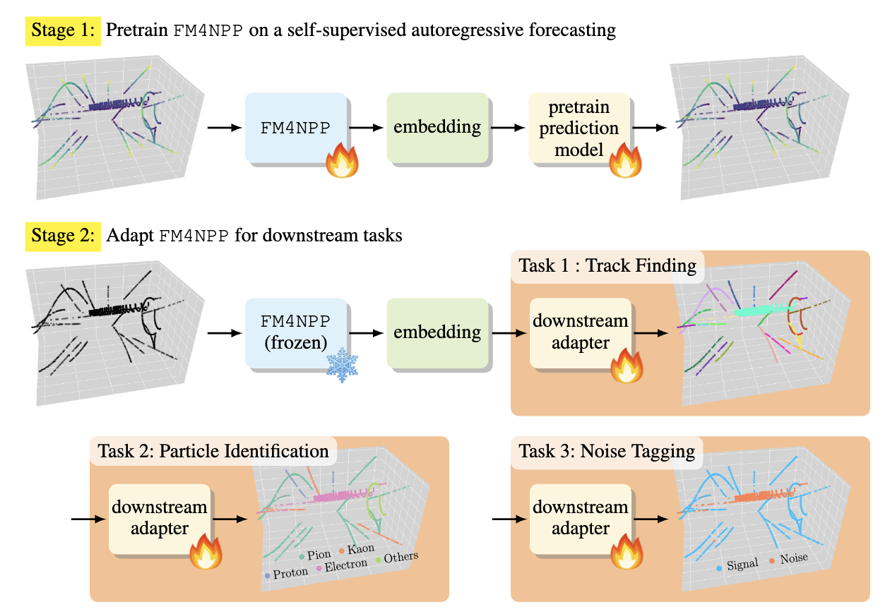

# Foundation Models for Nuclear and Particle Physics (FM4NPP)

<p align="left">
  
</p>

**🎉 Accepted to ICLR 2026!**  
See the paper on OpenReview: https://openreview.net/forum?id=qaI3cLFsiX

**Brookhaven National Laboratory**

David Keetae Park\*, Shuhang Li\*, Yi Huang\*, Xihaier Luo, Haiwang Yu, Yeonju Go, Christopher Pinkenburg, Yuewei Lin, Shinjae Yoo, Joseph D. Osborn, Jin Huang, Yihui "Ray" Ren†

\* equal contribution; † corresponding author

[[`OpenReview`](https://openreview.net/forum?id=qaI3cLFsiX)] [[`Dataset`](https://doi.org/10.5281/zenodo.16970029)] [[`Dataset Paper`](https://www.sciencedirect.com/science/article/pii/S2352340925011060)] [[`BibTeX`](#citation)]  [[`Model Checkpoints`](https://huggingface.co/FM4NPP/PP_collision)]

--- 

**Publication Repository**: Minimal implementation for reproducibility

This repository contains the essential code for:
1. **Pretraining**: State space models (Mamba, Mamba2) on particle physics data
2. **Downstream Task**: Track reconstruction using pretrained representations

**Paper (OpenReview)**: [Foundation Models for Particle Physics](https://openreview.net/forum?id=qaI3cLFsiX)

## ⚠️ Checkpoint naming: repo `m1` is NOT the paper's `m1`

The released checkpoint filenames follow this repository's internal config names,
which do **not** match the model names used in the paper. Check this table before
downloading, or you will train an adapter on a model 16x larger (or smaller) than
you intended.

| checkpoint on HF | repo config | width | params | **paper's name** |
|---|---|---|---|---|
| `pp_nerf_m1_k30.ckpt` | `d9_m1_k30_p20` | 256 | 5.3M | **m3** |
| `pp_nerf_m3_k30.ckpt` | `d9_m3_k30_p20` | 512 | 21M | **m4** |
| `pp_nerf_m4_k30.ckpt` | `d9_m4_k30_p20` | 1024 | 84M | **m5** |
| `pp_nerf_m5_k30.ckpt` | `d9_m5_k30_p20` | 1536 | 188M | **m6** |

The paper's `m1` (width 64, 0.34M) and `m2` (width 128, 1.3M) are configs
`d9_m64_k30_p20` and `d9_m128_k30_p20`; their checkpoints are not published.

All released checkpoints are **Mamba2** backbones (`mambaversion: mamba2`), built from
the pure-PyTorch `fm4npp/models/mamba2.py`. You do **not** need to compile `mamba-ssm`
to reproduce the paper -- that dependency is only used by the `mamba1` backbone.

## Running on Perlmutter

A step-by-step walkthrough for NERSC Perlmutter -- environment, data, SLURM scripts, the
checks to run at each stage, and the numbers to expect -- is in
**[PERLMUTTER.md](PERLMUTTER.md)**.

## Repository Structure

```
FM4NPP_Public/
├── fm4npp/
│   ├── models/          # Model architectures (Mamba, Mamba2)
│   ├── datasets/        # Data loading and preprocessing
│   └── utils.py         # Utilities and configuration
├── train/
│   ├── pretrain/
│   │   └── nppmamba/    # Pretraining scripts
│   └── downstream/      # Track reconstruction training
├── scripts/
│   ├── configs/         # Configuration files
│   └── run/             # SLURM submission scripts
└── README.md
```

## Installation

### Requirements
- Python 3.10+
- PyTorch 2.4+
- CUDA 12.1+
- mamba-ssm (for Mamba models)
- causal-conv1d
- triton

### Setup
```bash
# Create conda environment
conda create -n fm4npp python=3.10
conda activate fm4npp

# Install PyTorch
pip install torch torchvision --index-url https://download.pytorch.org/whl/cu121

# Install Mamba dependencies
pip install mamba-ssm causal-conv1d
pip install triton

# Install other requirements
pip install pyyaml numpy scipy tqdm mmap-ninja
```

## Usage

### 1. Pretraining

Train Mamba or Mamba2 models on particle physics data:

```bash
# Configure paths in scripts/configs/mamba_pretrain.yaml
# Edit: data_root, checkpoint_dir, stat_dir

# Submit pretraining job (SLURM)
sbatch scripts/run/submit_mamba_pretrain.sh

# Or run directly
python -m train.pretrain.nppmamba.train_multi_gpu \
    --yaml_config=scripts/configs/mamba_pretrain.yaml \
    --config=mamba_5m \
    --run_num=run0
```

### 2. Track Reconstruction (Downstream)

Fine-tune pretrained model for track finding:

```bash
# Configure paths in scripts/configs/mamba_tracking.yaml
# Edit: data_root, pretrained_ckpt, checkpoint_dir

# Submit downstream job (SLURM)
sbatch scripts/run/submit_downstream_mamba.sh

# Or run directly
python train/downstream/track_finding_trainer.py \
    --yaml_config=scripts/configs/mamba_tracking.yaml \
    --config=mamba_5m_downstream \
    --run_num=run0
```

## Configuration

### Key Parameters

**Mamba 5M Model**:
- `embed_dim`: 256
- `num_layers`: 12
- `d_state`: 16 (state space dimension)
- `d_conv`: 4 (convolutional kernel size)
- `expand`: 2 (expansion factor)

**Mamba2 5M Model**:
- `embed_dim`: 256
- `num_layers`: 12
- `d_state`: 128 (state space dimension)
- `headdim`: 64
- `ngroups`: 1

**Training**:
- `batch_size`: 256 (distributed across GPUs)
- `max_lr`: 2e-4
- `warmup_steps`: 1000
- `total_steps`: 50000

## Dataset

### TPCpp-10M Dataset

We provide the preprocessed dataset used in our paper on Zenodo:

**Dataset**: [TPCpp-10M: Simulated proton-proton collisions in Time Projection Chamber for AI Foundation Models](https://doi.org/10.5281/zenodo.16970029)

**Dataset Paper (TPCpp-10M)**: https://www.sciencedirect.com/science/article/pii/S2352340925011060

**Dataset Statistics**:
- **Unlabeled data**: 10M events (100 files) for pretraining
- **Labeled training**: 70k events for downstream tasks
- **Labeled validation**: 13k events
- **Labeled test**: 7k events
- **Total size**: ~118.5 GB (compressed)

**Data Format**: NumPy compressed format (.npz)

### Download Dataset

```bash
# Download from Zenodo
wget https://zenodo.org/records/16970029/files/TPCpp-10M.tar.gz

# Extract
tar -xzf TPCpp-10M.tar.gz

# Dataset structure after extraction (flat .npz, NOT RaggedMmap):
TPCpp-10M/
├── unlabeled/
└── labeled/
    ├── train/        # 70k labeled events
    │   ├── spacepoints.npz    # 'data' (N, 4) float32 + 'size' (n_events,)
    │   ├── track_ids.npz
    │   ├── pid_labels.npz
    │   └── noise_tags.npz
    ├── val/          # 13k
    └── test/         # 7k
```

The training code does not read `.npz` -- it reads memory-mapped `RaggedMmap`
directories. Convert first:

```bash
python scripts/prepare_data.py --in_dir TPCpp-10M/labeled/train \
                               --out /path/to/mmap_train --split pretrain
python scripts/prepare_data.py --in_dir TPCpp-10M/labeled/test \
                               --out /path/to/mmap_test  --split test
```

Note `--split pretrain` for the *training* data: the training dataloader is
hardcoded to the `pretrain` suffix. See `SETUP.md`.

### Data Format Details

Each spacepoint includes:
- **Position**: (x, y, z) coordinates in TPC
- **Energy**: Energy deposition at the point
- **Labels** (for downstream tasks):
  - Track IDs: Segmentation labels for track reconstruction
  - Particle IDs: 5 classes (electron, photon, pion, kaon, proton)
  - Noise tags: Binary labels (signal/noise)

**Feature dimensions**: 4D per point -- `(E, x, y, z)`

(Earlier revisions of this README claimed 30D with momentum and detector metadata.
That is wrong: the published spacepoints are 4-dimensional. See `SETUP.md` for the
target formats and for the `reg_target` layout that carries the momentum/vertex
information.)

### Usage with Code

After downloading, update config paths:

```yaml
# In scripts/configs/mamba_pretrain.yaml
data_root: /path/to/TPCpp-10M/unlabeled
stat_dir: /path/to/TPCpp-10M/statistics

# In scripts/configs/mamba_tracking.yaml
data_root: /path/to/TPCpp-10M/labeled_train
data_root_test: /path/to/TPCpp-10M/labeled_test
```

See `demo.ipynb` in the dataset for data exploration and visualization examples.

## Citation

If you use this code or dataset, please cite both papers:

```bibtex
@article{park2025fm4npp,
  title={FM4NPP: A Scaling Foundation Model for Nuclear and Particle Physics},
  author={Park, David and Li, Shuhang and Huang, Yi and Luo, Xihaier and Yu, Haiwang and Go, Yeonju and Pinkenburg, Christopher and Lin, Yuewei and Yoo, Shinjae and Osborn, Joseph and others},
  journal={arXiv preprint arXiv:2508.14087},
  year={2025}
}

@article{tpcpp10m2025,
  title={TPCpp-10M: Simulated proton-proton collisions in a Time Projection Chamber for AI Foundation Models},
  author={Li, Shuhang and Huang, Yi and Park, David and Luo, Xihaier and Yu, Haiwang and Go, Yeonju and Pinkenburg, Christopher and Lin, Yuewei and Yoo, Shinjae and Osborn, Joseph and Roland, Christof and Huang, Jin and Ren, Yihui},
  journal={arXiv preprint arXiv:2509.05792},
  year={2025}
}
```

OpenReview:
- Model paper: https://openreview.net/forum?id=qaI3cLFsiX

## Contact

For questions or issues, please open a GitHub issue.
