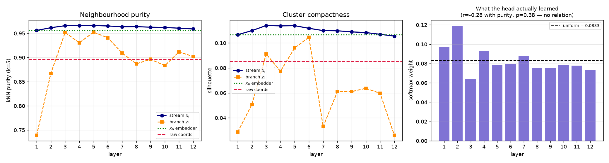

# Module 04 — What did the foundation model actually learn?

| | |
|---|---|
| **Input** | `pp_nerf_m5_k30.ckpt` (the paper's **m6**, 174.7M) + 10 events |
| **Algorithm** | frozen-backbone forward → residual-stream reconstruction → t-SNE + probes |
| **Output** | `features.npz` (~160 MB), three figures, two probe curves |
| **Visualization** | t-SNE colored by ground-truth track |

The model was pretrained with **no labels** — its only task was predicting each spacepoint's
30 nearest neighbours. This module asks what that bought.

## Run it

```bash
source common/paths.sh && source $FM4NPP_WORK/.venv/bin/activate
cd 04_features_tsne

python extract_features.py --n_events 10 --out features.npz     # ~1 min on a GPU
python analyze_features.py features.npz --out figures/          # ~4 min on CPU
jupyter lab tsne_explore.ipynb                                  # the narrative version
```

`--model m3` swaps in the 4.92M backbone if you want the comparison.

## The one trap to avoid

`return_z=True` does **not** give you the model's representation. Look at the forward:

```python
for layer in self.mamba_layers:
    z = layer(x)
    feature.append(z)      # <-- what you get: this block's CONTRIBUTION
    x = z + x              # <-- the accumulated stream, never returned
```

A late block's contribution is a small refinement and looks like noise on its own. Probe it
and you will conclude the model degrades with depth — `z₁₂` scores **below the raw detector
coordinates** on silhouette.

Reconstruct the stream instead:

```
x_i = x_0 + Σ_{j<i} z_j      with x_0 = embedder(change_maskval(input))
```

`extract_features.py` saves `x_0` for exactly this. The reconstruction is exact — checked
against forward hooks on the real layer inputs, agreement to **1.9e-06**, one float32 ULP.

## What we measured



| representation | silhouette | kNN purity (k=5) |
|---|---|---|
| raw `(E, η, φ, r)` | 0.0850 | 0.8958 |
| `x₀` — embedder output, **no Mamba layers** | 0.1066 | 0.9561 |
| stream, layer 4 (best) | 0.1137 | **0.9662** |
| stream, layer 12 | 0.1055 | 0.9591 |
| branch `z₁₂` alone | 0.0260 | 0.9020 |

**The NeRF embedder does most of the work — and it is not even learned.** kNN purity goes
0.896 → 0.956 before a single state-space layer runs. The embedder's Fourier projection
(`embedder.embed.projection`, 63×256) is a **fixed random matrix** with `requires_grad=False`
— 16,384 of m3's 4,923,386 parameters, frozen from initialization. Most of the measured gain
over raw coordinates comes from a random feature map, not from pretraining.

**Twelve Mamba layers add ~+0.010, peaking mid-network** at layers 4–5, then giving most of
it back. The final representation is barely better than the embedder output *on this metric*.

## Does the head know which layers are good?

The adapter doesn't use the last layer — it learns a softmax over all twelve. If our probes
measured something it cares about, its weights should correlate.

**They don't:** r = −0.28, p = 0.38. The learned weights are near-uniform (entropy 2.472 vs
2.485 uniform) with a mild early-layer tilt, tracking neither probe.

That has a practical payoff, verified independently on two otherwise identical 40-epoch runs:

| layer mixing | best ARI₂ |
|---|---|
| learned (12 free weights) | 0.8480 |
| frozen (collapsed to 1 vector) | **0.8508** |

Within seed noise — which is what makes the official repo's `--combine_layers` cache
possible: **12× less storage** (2.17 TB → 185 GB for the 70k training split) at no
measurable accuracy cost.

## The caveat that matters

You could read the table above as "the Mamba layers barely help." **Don't.**

Both probes measure *Euclidean geometry in the raw feature space*. The real head is a query
decoder with **attention and Hungarian matching** — it doesn't need tracks to be round
compact blobs, it needs structure attention can read. Note in the t-SNE that tracks form
smooth **1-D filaments**, not blobs; that is physically correct for trajectories and exactly
the case a compactness metric undersells.

Scale genuinely does help, measured on held-out track reconstruction over 6,943 events:

| backbone | params | pooled ARI |
|---|---|---|
| m3 | 4.92M | 0.8176 |
| m6 | 174.7M | **0.8591** |

A 33× larger backbone buys +0.042 downstream, while our geometric probes see almost no
difference between its own layer 1 and layer 12.

**The transferable lesson:** a flat unsupervised probe is evidence about the probe as much as
about the model. Validate representations on the task you care about.

## Figures

| file | what |
|---|---|
| `tsne_events.png` | final stream, 10 events, colored by true track |
| `tsne_layer_sweep.png` | stream vs branch across depth — the contrast that makes the point |
| `probes_by_layer.png` | both probes per layer + the head's learned weights |

## Cost

10 events → 5,176 points → `(12, 5176, 1536)` float16 ≈ 160 MB. Extraction 16 s on one GPU.
Storage scales linearly: 100 events is ~1.6 GB. float16 is lossless here — the forward runs
under bf16 autocast (8 mantissa bits) and float16 carries 10; measured range is [−7.6, 9.6],
far inside float16's limit.

## Next

- Re-run with `--model m3`: does the 4.92M model show the same layer profile?
- Raise `k` in `knn_purity` to 10 or 20 — does the ranking hold?
- Colour by `pid_target` instead of `seg_target`: is particle *type* linearly visible?
